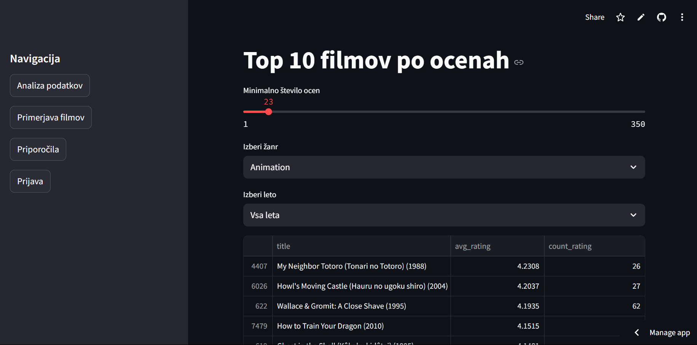
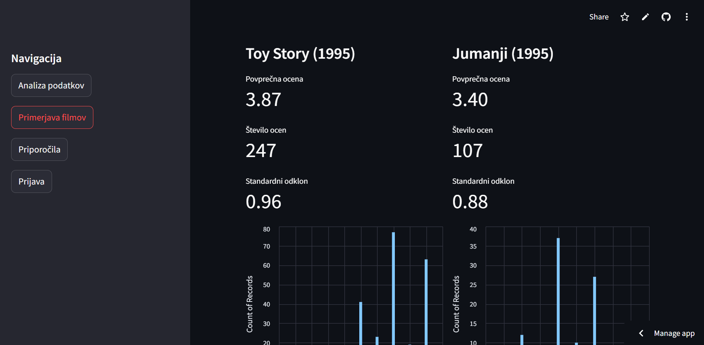
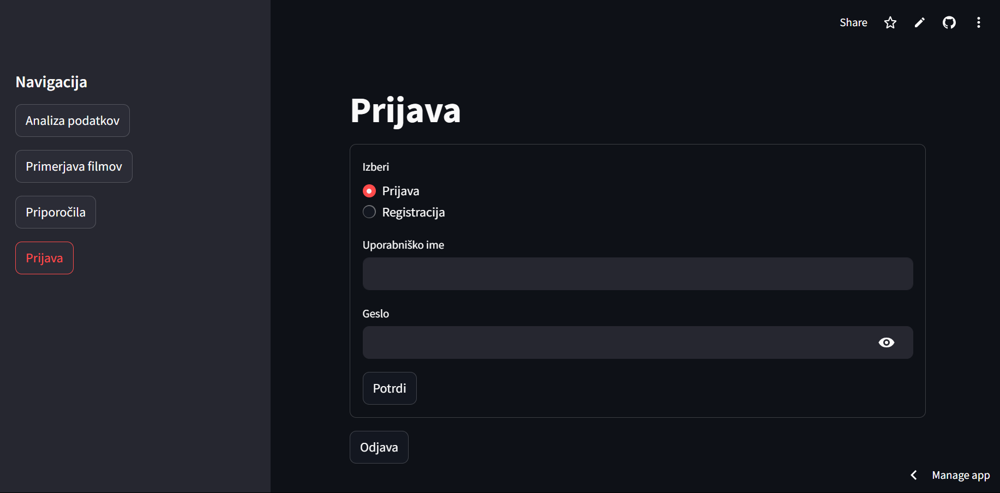
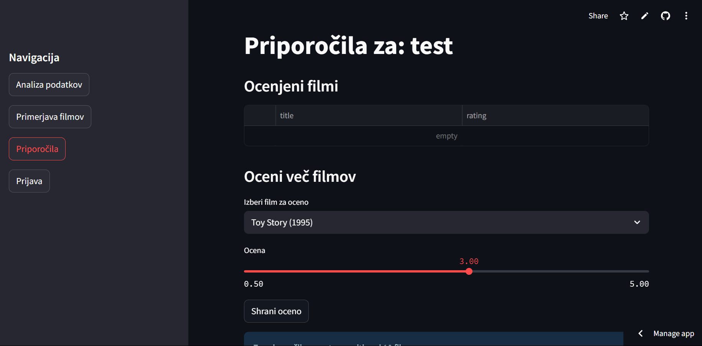
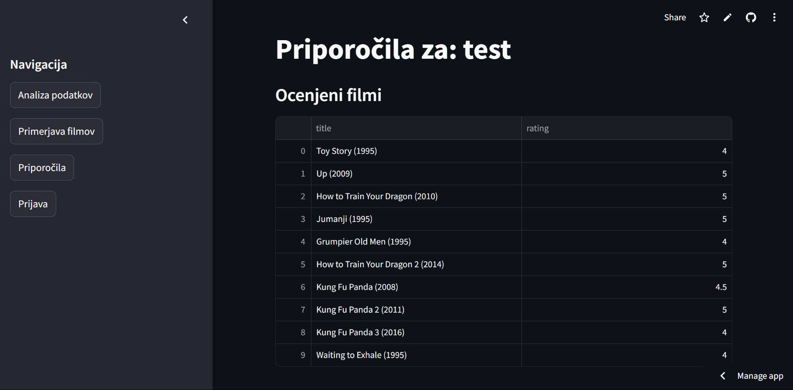
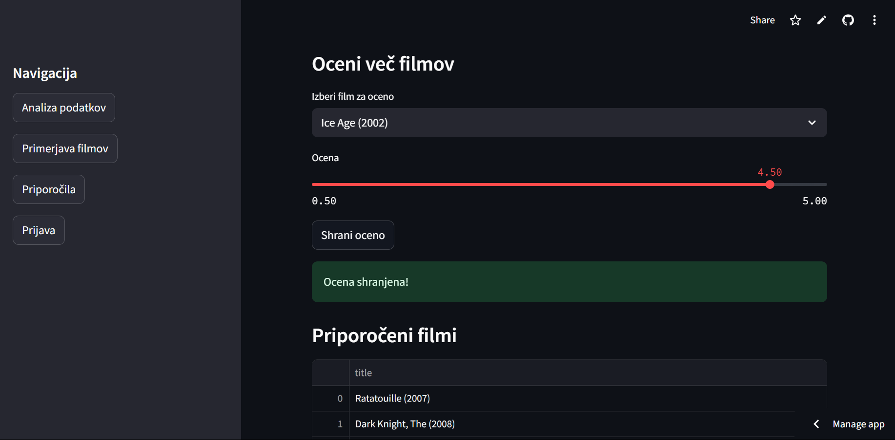
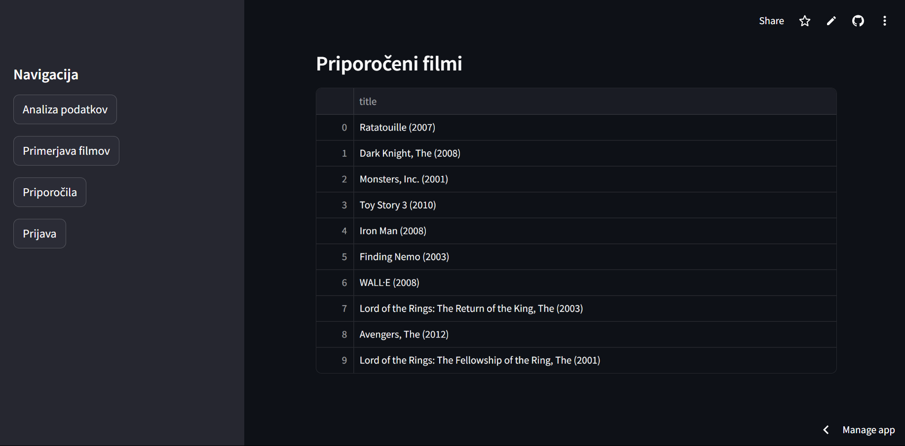

# Aplikacija za filmoljube

URL aplikacije: https://filmialneki.streamlit.app

GitHub z izvorno kodo: https://github.com/najmanjsi/pr-dn4-filmi

### Analiza
Ko vnesemo naslov in pridemo na aplikacijo, se nam najprej prikaže stran, kjer lahko določimo naslednje parametre: minimalna ocena (drsnik od 1 do 350), žanr in leto filma. Spodaj se nam izpišejo filmi, ki ustrezajo določenim parametrom.

### Navigacija
Levo lahko odpremo zavihek, kjer navigiramo med štirimi stranemi aplikacije: analiza podatkov, primerjava filmov, priporočila in prijava.

### Primerjava
Za primerjanje filmov imamo že vnešena prva dva filma iz MovieLens, seveda pa si ju lahko poljubno izberemo tudi sami. Spodaj se v dveh stolpcih prikaže statistika za posamezen film (osnovna statistika in trije grafi).

### Prijava
Za uporabo ocenjevanja in priporočilnega sistema se moramo najprej prijaviti. Če še nimamo računa pa se moramo prej še registrirati, da tako vnesemo novo tabelo v podatkovno bazo, kjer se bodo hranile tudi ocene filmov in priporočila.

### Priporočila
Ko smo prijavljeni, dobimo dostop do priporočilne strani. Tam imamo možnost ocenjevanja filmov, kar storimo z drsnikom (ocene od 0.5 do 5.0). Ko jih ocenimo 10, se nam spodaj pojavijo priporočila, ki so upoštevajo naše ocenjene filme.
 - Brez ocen

 - Z ocenami in priporočili

### Odjava
Če se hočemo odjaviti, pa je gumb za to v prijavnem zavihku.